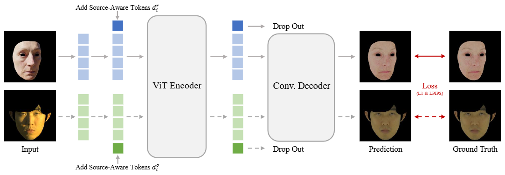
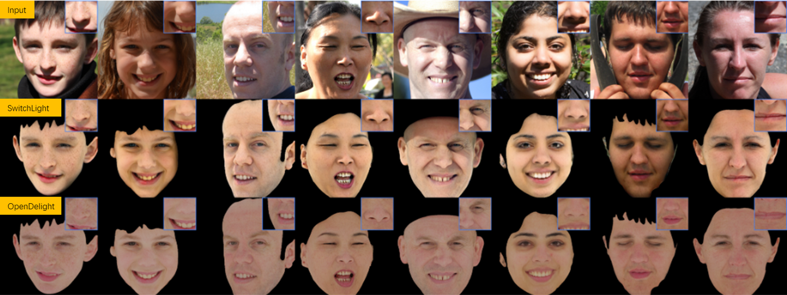

# OpenDelight: Delighting Prior Makes Appearance Capture Easy

This is a PyTorch implementation of the following paper:

**Learning a Delighting Prior for Facial Appearance Capture in the Wild.**, SIGGRAPH 2026.

Yuxuan Han, Xin Ming, Tianxiao Li, Zhuofan Shen, Qixuan Zhang, Lan Xu, and Feng Xu

[Project Page](https://github.com/yxuhan/OpenDelight) | [Video](https://www.youtube.com/watch?v=cfHw-IWA35c) | [Paper]()

## Feature
OpenDelight is a **fully open-source, high-performance** delighting prior tailored for facial appearance capture.
It produces better results than the the best proprietary model, [SwitchLight](https://beeble.ai/), with significantly fewer shadow-baking artifacts.

## Document
First, please follow the guidelines in [doc/ENV.md](doc/ENV.md) to configure the environment for OpenDelight.

* (TODO) To reproduce the training pipeline of OpenDelight, refer to [doc/TRAIN.md](doc/TRAIN.md). It documents the entire workflow from rendering synthetic datasets to network training.
  Training OpenDelight to match the results reported in our paper is computationally cost-effective: it only takes **2 × NVIDIA RTX 3090 GPUs** and converges within 3–4 days.

- (DONE) If you want to test our pre-trained model or leverage OpenDelight for facial appearance capture from a smartphone video (as we show in the paper), skip the training step directly and refer to [doc/TEST.md](doc/TEST.md).

## Contact
If you have any questions or are interested in collaboration, please contact Yuxuan Han (hanyx22@mails.tsinghua.edu.cn).

## Citation
Please include the following citations if it helps your research:

    @inproceedings{han2026opendelight,
        author = {Han, Yuxuan and Ming, Xin and Li, Tianxiao and Shen, Zhuofan and Zhang, Qixuan and Xu, Lan and Xu, Feng},
        title = {Learning a Delighting Prior for Facial Appearance Capture in the Wild},
        booktitle = {SIGGRAPH},
        year={2026}
    }

